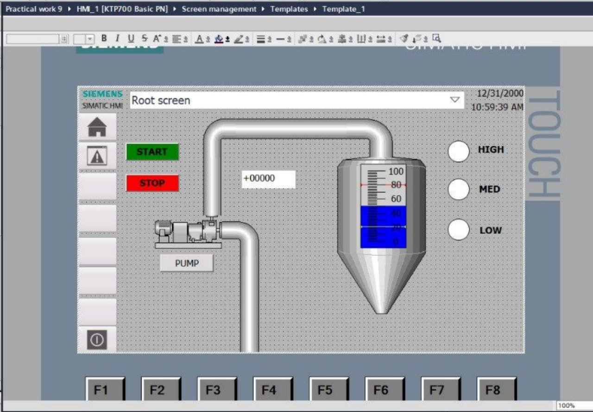

# CONTROL OF TANK FILLING, MIXING AND PUMPING WITH FBD LANGUAGE

This project is about controlling a process tank automatically, using FBD (Function Block Diagram) in TIA Portal. The tank can fill with liquid, mix it, and then pump it out — all controlled by a PLC program instead of manual switches.

This kind of system is used in real factories: food production, chemical plants, pharmaceutical plants — anywhere liquids need to be stored, mixed, and moved safely.

## Blocks I used

* AND / OR / NOT – to combine sensor signals and decide what should happen next.
* TON / TOF / TP timers – to add delays or short pulses (for example, wait a few seconds before starting the mixer).
* RS / SR triggers – to "remember" a state, like keeping the pump ON until a stop condition happens.
Scaling and comparison blocks – to turn analog sensor values into real numbers (like percentage of tank level) and compare them to set points.

## Safety and Protection
Because tanks and pumps are physical equipment, protecting them is a big part of this project:
* Hysteresis is added between the ON and OFF levels, so valves and pumps don't switch on and off too fast and wear out.
* If something dangerous happens — like the tank running dry or overflowing — the system stops the equipment right away and sends an alarm.
* Alarms stay active (latched) until the operator confirms them on the HMI screen, even if the problem is already gone. This way, nothing gets ignored.

## Video Demonstration (Just click to the picture)

